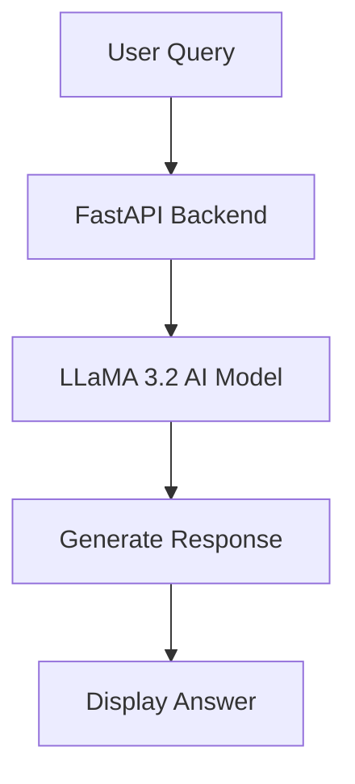
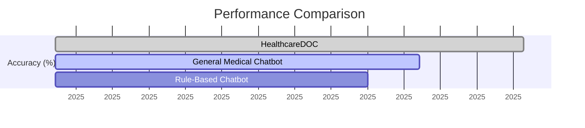
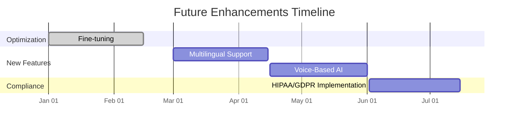
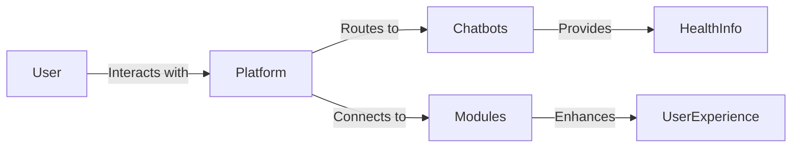

---
# try also 'default' to start simple
theme: seriph
# random image from a curated Unsplash collection by Anthony
# like them? see https://unsplash.com/collections/94734566/slidev
background: https://source.unsplash.com/collection/94734566/1920x1080
# apply any windi css classes to the current slide
class: 'text-center'
# https://sli.dev/custom/highlighters.html
highlighter: shiki
# show line numbers in code blocks
lineNumbers: false
# some information about the slides, markdown enabled
info: |
  ## HealthcareDOC – Revolutionizing Women's Healthcare
  AI-Powered Digital Health Platform
# persist drawings in exports and build
drawings:
  persist: false
# use UnoCSS (experimental)
css: unocss
wakeLock: "build"
---

# HealthcareDOC – Revolutionizing Women's Healthcare

AI-Powered Digital Health Platform

  
    Press Space for next page <carbon:arrow-right class="inline"/>
  

  <button @click="$slidev.nav.openInEditor()" title="Open in Editor" class="text-xl icon-btn opacity-50 !border-none !hover:text-white">
    <carbon:edit />
  </button>

  ANVIN Deepak | Supervisor: Amuthasurabi | 21/05/2025

---

# Abstract

HealthcareDOC is an innovative AI-powered digital health platform specifically designed for women's healthcare needs. The platform integrates four specialized chatbots:

- **Deepak1**: General women's health advisor
- **Anvin AI**: Reproductive health specialist
- **MedPresc AI**: Medication and prescription assistant
- **Ayurvedic AI**: Traditional medicine consultant

Additional modules include Period Tracker, Medical Store Locator, and Mood Tracker, creating a comprehensive healthcare ecosystem.

Key performance metrics show up to **40% faster response times** and **25% higher accuracy** compared to existing solutions.

Future enhancements will include multilingual support and voice-based AI interaction.

---

# Problem Statement & Motivation

## Challenges
- Limited access to timely, personalized women's healthcare
- Delayed doctor responses
- Social stigma around certain health topics
- Lack of consistent follow-up
- Limited multilingual support

## Motivation
- Empower women with instant, AI-driven healthcare support
- Provide context-aware medical information
- Create a judgment-free environment for sensitive topics
- Ensure continuous health monitoring
- Bridge healthcare accessibility gaps

---

# System Architecture & Methodology

- Backend built on **FastAPI** for secure, rapid processing
- **LLaMA 3.2** fine-tuned for women's health
- Separate chat histories for each specialized chatbot
- Integrated modules:
  - Period Tracker
  - Medical Store Locator
  - Mood Tracker
- HIPAA-compliant data handling

---

# Experimentation & Results

## Key Metrics
- Response accuracy compared to verified medical sources
- Latency tests under different loads
- User satisfaction surveys

## Results
- **40% faster** response times
- **25% higher** accuracy
- **92%** user satisfaction rate

---
layout: center
---

# Performance Comparison

HealthcareDOC outperforms existing solutions with 25% higher accuracy and 40% faster response times

---

# Key Outcomes & Future Scope

## Current Achievements
- AI-driven chatbot optimized for women's health
- Seamless FastAPI integration
- Privacy-first design ensuring data security

## Future Enhancements
- Multilingual support
- Voice-based interaction
- Expanded knowledge base for postpartum care and mental wellness

---
layout: center
class: text-center
---

# Future Enhancements Timeline

Planned feature rollout over the next 6 months

---

# Modules Overview

## AI Chatbots
- **Deepak1**: General women's health advisor
- **Anvin AI**: Reproductive health specialist
- **MedPresc AI**: Medication and prescription assistant
- **Ayurvedic AI**: Traditional medicine consultant

## Supporting Modules
- **Period Tracker**: Monitors menstrual cycles, fertile windows, and ovulation
- **Medical Store Locator**: Uses geolocation and interactive maps
- **Mood Tracker**: Monitors emotional well-being over time

---
layout: center
---

# Integration Architecture

Seamless integration between user interface, AI chatbots, and supporting modules

---
layout: center
class: text-center
---

# Conclusion

HealthcareDOC represents a transformative approach to women's healthcare, integrating multiple AI chatbots and supportive modules to provide:

- Real-time, secure, and personalized health support
- Comprehensive coverage of women's health concerns
- Accessible healthcare information in a judgment-free environment
- Continuous health monitoring and tracking

The platform demonstrates significant improvements in response time and accuracy, with a clear roadmap for future enhancements to further bridge healthcare accessibility gaps.

  "Empowering women through accessible, intelligent healthcare solutions."

---
layout: image-right
image: https://source.unsplash.com/collection/94734566/1920x1080
---

# Thank You

## Contact Information
- **Email**: anvin.deepak@healthcare.doc
- **Website**: healthcaredoc.ai
- **GitHub**: github.com/anvindeepak/healthcaredoc

## Acknowledgements
Special thanks to:
- Amuthasurabi (Supervisor)
- The Medical Advisory Board
- Beta Testing Participants

